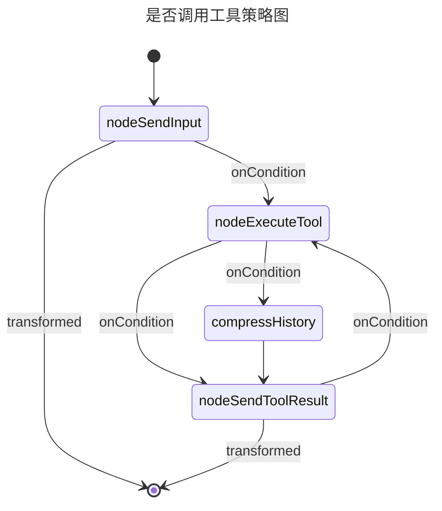

# KotCode 项目说明
---
该项目是基于 kotlin koog 所搭建的一个AI Agent，基本实现了最轻量级的文件处理功能（这些功能的实现是采用 koog 内部自带的功能实现的，没有额外增加工具）

由于目前作者本人还在学习阶段，处理上可能并不完善，但也算是一个很不错的基础案例展示.

比如说项目采用的策略图结构的处理和写法，对于初学者应该都有所帮助:

如果在运行阶段，看到里面的中文注释不利于理解，完全可以通过这个 AI Agent 把里面的中文注释改成英文，祝你学习愉快。