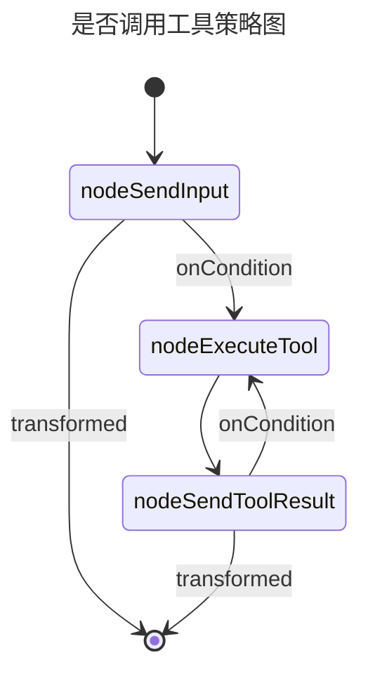
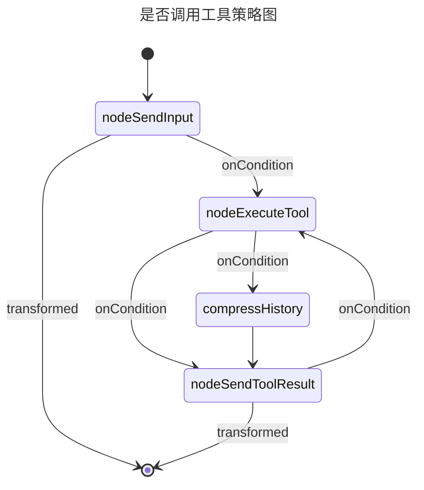

```mermaid
---
title: 是否调用工具策略图
---
stateDiagram
    state "nodeSendInput" as nodeSendInput
    state "nodeExecuteTool" as nodeExecuteTool
    state "nodeSendToolResult" as nodeSendToolResult

    [*] --> nodeSendInput
    nodeSendInput --> [*] : transformed
    nodeSendInput --> nodeExecuteTool : onCondition
    nodeExecuteTool --> nodeSendToolResult
    nodeSendToolResult --> [*] : transformed
    nodeSendToolResult --> nodeExecuteTool : onCondition
```

```mermaid
---
title: 是否调用工具策略图
---
stateDiagram
    state "nodeSendInput" as nodeSendInput
    state "nodeExecuteTool" as nodeExecuteTool
    state "compressHistory" as compressHistory
    state "nodeSendToolResult" as nodeSendToolResult

    [*] --> nodeSendInput
    nodeSendInput --> [*] : transformed
    nodeSendInput --> nodeExecuteTool : onCondition
    nodeExecuteTool --> compressHistory : onCondition
    nodeExecuteTool --> nodeSendToolResult : onCondition
    compressHistory --> nodeSendToolResult
    nodeSendToolResult --> [*] : transformed
    nodeSendToolResult --> nodeExecuteTool : onCondition
```